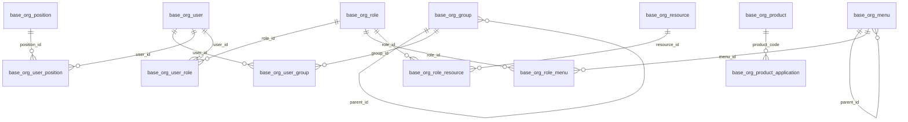

# 数据模型与 ER 图

本文档对应当前完整建库脚本 [`os-base-org-ddl.sql`](../src/main/resources/db/os-base-org-ddl.sql)。数据库没有声明物理外键；连线是由字段和业务代码维护的逻辑关系。

| 模型分组 | 表 | 说明 |
| --- | --- | --- |
| 组织与人员 | `base_org_group`、`base_org_position`、`base_org_user` | 组织树、岗位和用户主体 |
| 人员关联 | `base_org_user_group`、`base_org_user_position` | 用户与组织、岗位的多对多关联 |
| 权限主体 | `base_org_role`、`base_org_user_role` | 角色以及用户角色关联 |
| 导航授权 | `base_org_menu`、`base_org_role_menu` | 产品范围内的菜单树和角色菜单授权 |
| 资源授权 | `base_org_resource`、`base_org_role_resource` | API/资源定义和角色资源授权 |
| 产品导航 | `base_org_product`、`base_org_product_application` | 产品及其应用入口 |

所有业务表均使用字符串主键。树结构的根节点由约定的 `parent_id` 表示；产品与菜单/资源之间通过 `product_code` 做逻辑隔离。数据库演进以 Flyway 目录为准。
